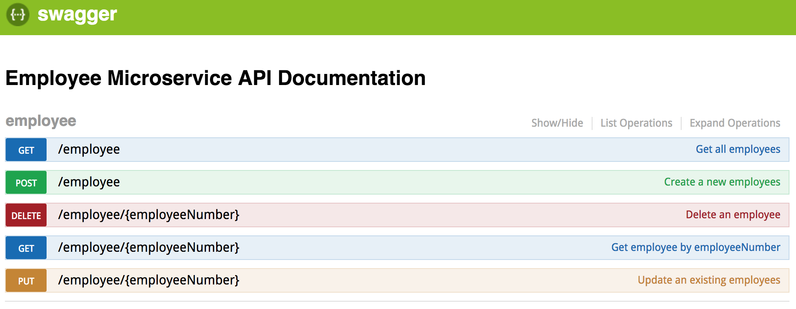

# employee-microservice-node

[](https://circleci.com/gh/omerio/employee-microservice-node) [](https://codecov.io/gh/omerio/employee-microservice-node)

Example Node.js CRUD microservice for an Employee entity with unit tests, mocking, code style checking and good test coverage. The microservice exposes REST APIs which are documented using [Swagger](http://swagger.io/).

## Getting Started

### Requirements:

* [Node.js](https://nodejs.org/en/download/)
* [Docker](https://www.docker.com/community-edition)

### Checkout and run the code

```bash
git clone https://github.com/omerio/employee-microservice-node.git
cd employee-microservice-node
npm install
npm start
```

Once the server is started you can access the following URLs:

* Server: http://localhost:8000/
* [Swagger](https://swagger.io/) API documentation: http://localhost:8000/docs



## Libraries

The following libraries are used in this project:

- **Web Server Framework**: [hapi](https://hapijs.com/) with [swagger](https://github.com/glennjones/hapi-swagger) and [good](https://github.com/hapijs/good) plugins. [Boom](https://github.com/hapijs/boom) for HTTP errors. [Request](https://github.com/request/request) for making HTTP requests
- **Logging**: [winston](https://github.com/winstonjs/winston)
- **Testing**: [mocha](https://mochajs.org/) with [chai](http://chaijs.com/) for [BDD](https://www.agilealliance.org/glossary/bdd) and [sinon](http://sinonjs.org/) for mocking
- **Code Coverage**: [nyc](https://github.com/istanbuljs/nyc)
- **Code Style**: [eslint](http://eslint.org/)
- **Deployment**: [Docker](https://www.docker.com/community-edition)

## Available build scripts
The available scripts are in the `package.json` file:

* `npm start` - start the application
* `npm run dev` - start the application in development mode, e.g. application reloads each time a change is made.
* `npm test` -  run the unit tests, the results are printed to the screen
* `npm run test-ci` -  run the unit tests, the results saved to a file to use in a Continous Integration tool
* `npm run test-debug` -  run the tests enabling debug mode
* `npm run coverage` -  run the code coverage
* `npm run debug` -  run the app in debug mode
* `npm run lint` -  run linting of the application code

## Unit Tests and Coverage

To run the unit tests

```bash
npm test
```

The test results are printed to the screen. To produce the test results in junit format use the `npm run test-ci` script

To generate the code coverage reports:

```bash
npm run coverage
```

The coverage reports are available in HTML format in `employee-microservice-node/coverage/index.html`

## CI-CD
This repository uses [CircleCI](https://circleci.com/gh/omerio/employee-microservice-node) for continuous integration and deployment. Circle CI configuration is in the [`circle.yml`](./circle.yml) file

Code coverage results are uploaded to [CodeCov](https://codecov.io/gh/omerio/employee-microservice-node).

## Docker
This microservice can be built as a docker container. See the [`Dockerfile`](./Dockerfile)

To build a docker image:
```bash
docker build -t omerio/employee-microservice-node .
```

To run the docker image:
```bash
docker run -p 8000:8000 omerio/employee-microservice-node
```

Publish the image to [Docker Hub](https://hub.docker.com/), using your Docker Hub login details:
```bash
docker login
docker push omerio/employee-microservice-node
```

## TODO
- Continuous deployment using CircleCI
- Add authentication
- Add JSDocs support
